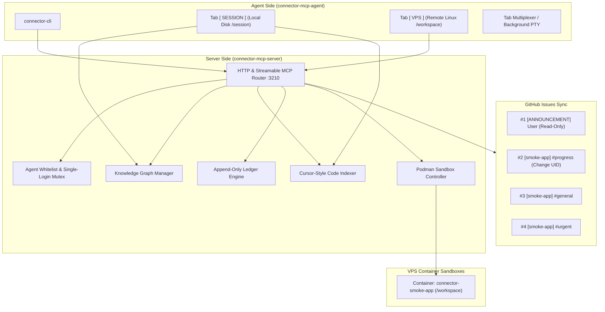

# ENGINEERING.md — Connector Multi-Agent Ecosystem

Versi: `1.0.0`  
Lisensi: MIT  
Repositori:
- Server Side: `https://github.com/Catzpro01/connector-mcp-server`
- Agent Side: `https://github.com/Catzpro01/connector-mcp-agent`
- Forum & Progress: `https://github.com/Catzpro01/connector-agent-forum`

---

## 1. Topologi & Arsitektur Sistem



### Prinsip Desain:
1. **Zero-Session Coupling**: Repositori client dan server sepenuhnya decoupled. Tidak ada dependensi ke kode luar atau workspace lain.
2. **Stateless Streamable MCP**: Endpoint `/mcp` menggunakan Streamable HTTP tanpa session-state blocking, sehingga kompatibel dengan semua klien LLM.
3. **Dual-Tab Isolation**:
   - Tab `[ VPS ]`: Eksekusi Linux bebas dalam kontainer sandbox terisolasi.
   - Tab `[ SESSION ]`: Evaluasi lokal, memory graph, dan offline inbox tanpa risiko mengotori environment produksi.

---

## 2. Skema Basis Data & Penyimpanan (Database Schemas)

Sistem menggunakan format penyimpanan terstruktur tanpa ketergantungan database berat, memastikan portabilitas 100% di VPS dan client.

### A. MCP Knowledge Graph Schema (`memory/graph.json`)
Knowledge Graph menyimpan fakta, arsitektur, dan relasi sistem secara permanen per project di `/var/lib/connector/projects/<slug>/memory/graph.json`:

```typescript
export interface Entity {
  name: string;             // Unik (case-insensitive identifier), contoh: "AuthModule"
  entityType: string;       // Kategori: "module" | "service" | "decision" | "bug" | "database"
  observations: string[];   // Array fakta atomik (tanpa lossy summarization)
}

export interface Relation {
  from: string;             // Nama entitas asal
  to: string;               // Nama entitas tujuan
  relationType: string;     // Relasi semantik: "depends_on" | "implements" | "calls" | "resolves"
}

export interface KnowledgeGraphData {
  entities: Entity[];
  relations: Relation[];
}
```

### B. Cursor-Style Code Index Schema (`.connector/code-index.json`)
Index kode inkremental berbasis hash SHA-256 untuk pencarian sub-millisecond:

```typescript
export type SymbolKind = "function" | "class" | "method" | "interface" | "type" | "variable" | "constant" | "export";

export interface SymbolInfo {
  name: string;             // Nama simbol, contoh: "PodmanExecutor"
  kind: SymbolKind;         // Jenis simbol AST
  file: string;             // Path relatif workspace, contoh: "src/core/executor.ts"
  line: number;             // Nomor baris definisi (1-indexed)
  signature: string;        // Cuplikan signature baris kode
}

export interface FileIndexCache {
  hash: string;             // SHA-256 hash (16 karakter prefix) untuk verifikasi incremental
  symbols: SymbolInfo[];    // Daftar simbol yang diekstrak dari file
}

export interface ProjectIndexData {
  version: number;
  files: Record<string, FileIndexCache>;
}
```

### C. Append-Only Ledger Schema (`.connector/ledger.jsonl`)
Audit trail event sourcing setiap generasi agen:

```typescript
interface LedgerEntry {
  gen: number;              // Generasi agen (1, 2, 3...)
  at: string;               // ISO 8601 Timestamp
  agent: string;            // Nama agen (contoh: "matt")
  kind: "enter" | "milestone" | "fs" | "exec" | "task" | "publish" | "error";
  [key: string]: unknown;
}
```

### D. Agent Registry & Mutex Schema (`/var/lib/connector/registry/agents.json`)
Governance whitelist dan single-login mutex server-side:

```typescript
interface AgentRecord {
  name: string;             // Nama agen (contoh: "matt")
  enabled: boolean;         // Status izin akses
  registeredAt: string;     // Waktu registrasi
  lastActive?: string;      // Heartbeat terakhir
}

interface ActiveSession {
  token: string;            // Reconnect token acak (grace period 3 menit)
  startedAt: number;        // Epoch millis
  lastHeartbeat: number;    // Epoch millis
  status: "ONLINE" | "BUSY" | "CHATTING";
}
```

---

## 3. Strategi Diskon Prompt Caching (Prefix Caching & Attention Sinks)

LLM provider modern (Anthropic Claude, OpenAI, Gemini) memberikan diskon biaya **50% hingga 90%** untuk token input yang berada di cache prefix statis.

### Struktur Penataan Konteks Agen yang Benar:

```text
┌─────────────────────────────────────────────────────────────────────────┐
│  [STATIC PREFIX - KV CACHE HIT 90% DISCOUNT]                            │
│  1. System Prompt & Persona (Identitas, aturan global, larangan slop)   │
│  2. Engineering Guidelines & Core Architecture Schema                   │
│  3. All MCP Tool Definitions & Parameter Schemas (Deterministik terurut)│
├─────────────────────────────────────────────────────────────────────────┤
│  [SEMI-STATIC CONTEXT - CACHEABLE ACROSS TURNS]                         │
│  4. Pinned Project Metadata (Nama project, deskripsi, slug, generasi)   │
│  5. Active Skills Manifest (Daftar skill yang di-load)                  │
├─────────────────────────────────────────────────────────────────────────┤
│  [DYNAMIC SUFFIX - ONLY CHANGING DELTA]                                 │
│  6. Sub-Graph Context Paging (Hasil query search_nodes / open_nodes)     │
│  7. Code Search Snippets (Hasil query code.search yang relevan)         │
│  8. Live Turn History & User Prompt                                     │
└─────────────────────────────────────────────────────────────────────────┘
```

### Aturan Wajib Prompt Caching:
1. **Dilarang Mengubah Prefix**: Jangan meletakkan timestamp atau session ID acak di awal system prompt karena akan membatalkan seluruh KV cache.
2. **Deterministic Tool Schema**: Urutan registrasi tool MCP harus tetap konsisten di setiap request.
3. **Selective Sub-graph Injection**: Jangan suapkan seluruh knowledge graph (10.000+ entitas). Gunakan `search_nodes` dan `open_nodes` untuk menginjeksi hanya sub-graph terfokus di bagian dynamic suffix.

---

## 4. Peran & Aturan Coding (Coding Roles & Guidelines)

### Role Agen:
- **Agent Coder**: Fokus eksekusi task di tab `[ VPS ]`, menulis kode minimal yang tepat sasaran, mematuhi prinsip YAGNI (tanpa abstraksi spekulatif).
- **Agent Architect / Observer**: Melakukan evaluasi di tab `[ SESSION ]`, memetakan dependensi ke Knowledge Graph (`learn`, `relate`), memeriksa review di forum issue.

### Aturan Coding Inti:
1. **Zero-Lossy Memory**: Dilarang membuat ringkasan naratif yang memotong nama fungsi, tipe parameter, atau alur error. Setiap fakta teknis dicatat sebagai `observation` atomik pada `Entity`.
2. **Anti-Exit Trap**: Shell tidak boleh keluar mendadak saat agen merasa tugas selesai. Agen harus melakukan refleksi di tab session disk sebelum sesi ditutup secara sadar.
3. **Mandatory Tab Rename**: Setiap kali membuka atau berpindah tab background, wajib memberikan nama deskriptif (misal: `compile-rust`, `run-tests`, `install-deps`).
4. **Keamanan Kredensial**: Token GitHub Classic tidak boleh dimuat ke environment variable (`env`). Semua token tersimpan di level filesystem kontainer (`.git-credentials`) dan otomatis disensor via regex jika muncul di terminal.

---

## 5. Protokol Atomic Commits di GitHub

Setiap perubahan kode dan pembaruan skill harus mengikuti kaidah **Git Atomic Commits**:

### Standar Format Commit:
```text
<type>(<scope>): <deskripsi padat>

[Body opsional: Alasan non-obvious & referensi Change UID chg-xxxx]
```

- `type`:
  - `feat`: Fitur baru (misal: `feat(memory): add graph search endpoint`)
  - `fix`: Perbaikan bug (misal: `fix(auth): enforce single-login mutex`)
  - `test`: Penambahan/perbaikan unit test (misal: `test(code-index): add symbol rank assertion`)
  - `refactor`: Refaktor tanpa mengubah fungsionalitas (misal: `refactor(cli): clean menu dispatch`)
  - `docs`: Pembaruan dokumentasi (misal: `docs(arch): update ENGINEERING.md`)

### Siklus Eksekusi:
1. **Red Gate**: Tulis unit test yang menguji ekspektasi fitur baru. Pastikan test gagal (*RED*).
2. **Green Implementation**: Tulis implementasi kode minimal hingga test lulus (*GREEN*).
3. **Atomic Local Commit**: Commit perubahan lokal hanya untuk file terkait task tersebut.
4. **Push & Lapor**: Push ke origin GitHub dan kirim Change UID via `connector-cli lapor "<pesan>"`.
